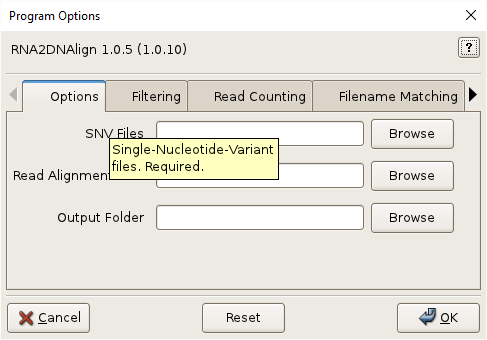
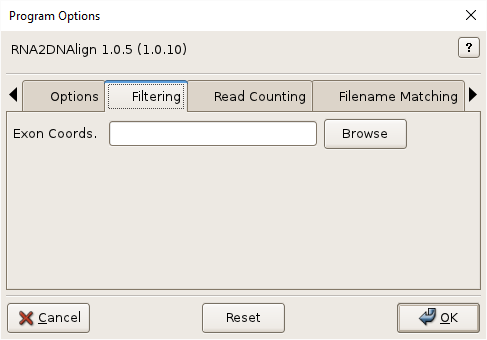
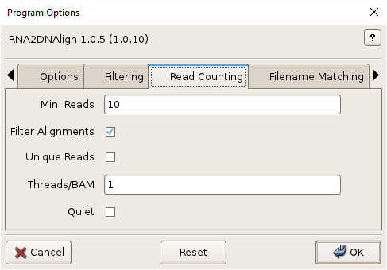
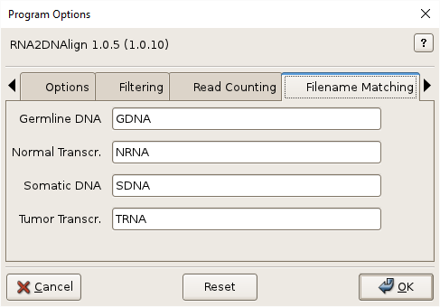
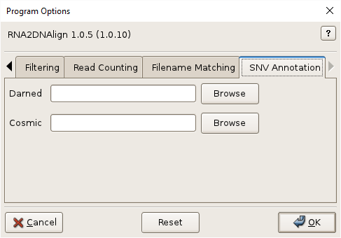

# RNA2DNAlign Usage

## Synopsis

### Graphical User Interface:

    RNA2DNAlign1
    RNA2DNAlign.py

### Command-line:

    RNA2DNAlign [options]
    RNA2DNAlign.py [options]

## Description

RNA2DNAlign evaluates evidence of allelic imbalance and asymmetry in next-gen
sequencing reads of DNA and RNA from normal and tumor samples from
the same individual.

## Graphical User Interface

Click the help icon (question mark) at the top right of the GUI and
then an input field for help. Multiple files can be selected in the
file-chooser using Ctrl-Click or Shift-Click. Fields can be reset to
their default values using the Reset button. Click OK to execute
RNA2DNAlign.

Additional GUI option tabs are documented below.

## Options

SNVs, -s SNVS, --snvs=SNVS

> Single-nucleotide-polymophisms (SNVs). Tabular and VCF format SNVs
> are supported. Multiple files are specified inside quotes, separated
> by spaces, and by using file globbing. See [Input
> Files](InputFiles.md) for more information. Required.

Read Alignment Files, -r ALIGNMENTS, --readalignments=ALIGNMENTS

> Read alignments files in indexed BAM format, with extension
> `.bam`. BAM index with extension `.bam.bai` must be located in the
> same directory. Multiple files are specified inside quotes,
> separated by spaces, and by using file globbing. See [Input
> Files](InputFiles.md) for more information. Required.

Output Folder, -o OUTPUT, --output=OUTPUT

> Output directory. Will be created if necessary. Files inside this directory will be overwritten by program output. See [Output Files](OutputFiles.md) for more information on output files. Required. 

--version

>Show program's version number and exit. 

-h, --help

>Show program help and exit.

### Filtering

Exon Coords., -e EXONCOORDS, --exoncoords=EXONCOORDS

> Exon coordinates to filter out non-coding SNVs. Use of exon coordinates to filter the SNVs is strongly recommended for semantic and performance reasons. See [Annotation Files](AnnotationFiles.md) for format and download information. Optional.

### Read Counting

Min. Reads, -m MINREADS, --minreads=MINREADS

> Minimum number of good reads at each SNV locus per alignment file. Default=10.   

Filter Alignments, -f, --alignmentfilter

> (Turn off) alignment filtering by length, edits, etc.

Unique Reads, -U, --uniquereads   

> Consider only distinct reads.  

Threads/BAM, -t TPB, --threadsperbam=TPB                   

> Worker threads per alignment file. Indicate no threading with 0. Default=1.

Quiet, -q, --quiet

> Do not show readCounts progress.

### Filename Matching

Germline DNA, --normaldnare=NORMALDNARE

> Germline/Normal DNA filename regular expression. Default: GDNA.

Normal Transcr., --normaltransre=NORMALTRANSRE 

> Normal transcriptome filename regular expression. Default: NRNA.

Somatic DNA, --tumordnare=TUMORDNARE      

> Somatic/Tumor DNA filename regular expression. Default: SDNA.

Tumor Transcr., --tumortransre=TUMORTRANSRE

> Tumor transcriptome filename regular expression. Default: TRNA.

### SNV Annotation

Darned, -d DARNED, --darned=DARNED

> DARNED Annotations. See [Annotation Files](AnnotationFiles.md) for format and download information. Optional.  

Cosmic, -c COSMIC, --cosmic=COSMIC

> COSMIC Annotations. See [Annotation Files](AnnotationFiles.md) for format and download information. Optional.

## See Also

[RNA2DNAlign Home](..), [Input Files](InputFiles.md), [Output Files](OutputFiles.md), [Annotation Files](AnnotationFiles.md)

